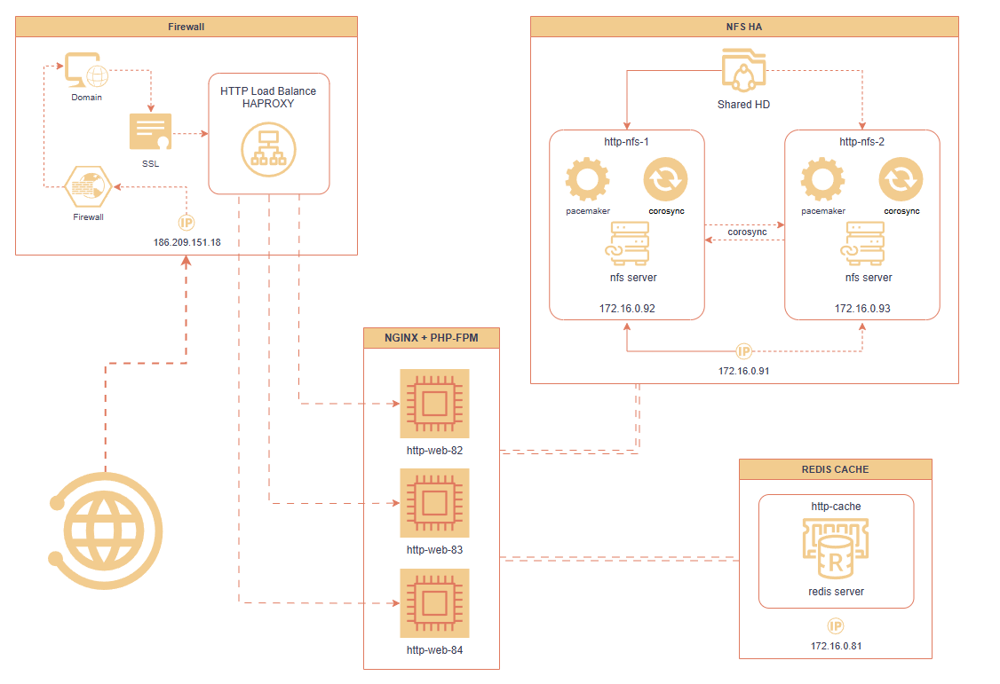

[← README](../README.md)

# Redis

Cache centralizado e storage de sessões para as aplicações (Web, Homologação,
WebSocket).

## Visão geral

| Campo | Valor |
|---|---|
| **Função** | Cache e sessions (PHP/WebSocket) |
| **Hostname** | `http-cache` |
| **IP** | 172.16.0.81 |
| **Versão** | 7.0.15 |
| **Porta** | 6379 (padrão) |

## Diagrama do fluxo completo (infraestrutura)



Posição do Redis no fluxo: os [Servidores Web](./webservers.md) gravam
sessions aqui após receberem a requisição do
[Firewall/HAProxy](./firewall-haproxy.md).

## Aplicações que usam

| Aplicação | Tipo de dados |
|---|---|
| [Servidores Web](./webservers.md) | Sessions do PHP |
| [Web Homologação](./webservers-homolog.md) | Sessions do PHP |
| [WebSocket](./websocket.md) | Presença de agentes (user:{id}:{platform}) |

## Configuração

| Item | Valor |
|---|---|
| **Arquivo de config** | `/etc/redis/redis.conf` |
| **Log** | `/var/log/redis/redis.log` |
| **Serviço systemd** | `redis-server.service` |

## Controle de processo

```bash
systemctl start redis-server.service
systemctl stop redis-server.service
systemctl restart redis-server.service
systemctl status redis-server.service
```

## Acesso

Conexão local (sem autenticação configurada):

```bash
redis-cli -p 6379
```

Comandos úteis:

```bash
# Status
redis-cli INFO

# Verificar chaves
redis-cli KEYS '*'

# Verificar tamanho
redis-cli DBSIZE

# Logs em tempo real
tail -f /var/log/redis/redis.log
```

## Notas operacionais

- **Sem persistência de disco**: por padrão, Redis em memória. Perda de dados
  em restart (adequado para sessões e cache temporário).
- **Namespaces**: aplicações usam prefixos para isolamento de dados no mesmo
  Redis (ex.: `user:`, `session:`).
- **TTL**: sessões e presença têm TTL configurado nas aplicações — Redis expira
  chaves automaticamente.
