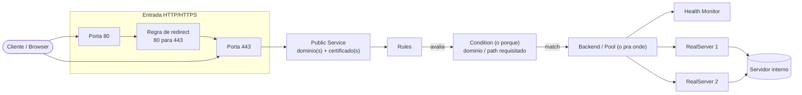

# Firewall / HAProxy

## Índice

- [Visão geral](#visão-geral)
- [Conceitos e componentes do plugin](#conceitos-e-componentes-do-plugin)
- [Fluxo lógico geral (dependências)](#fluxo-lógico-geral-dependências)
- [Aplicação principal (APP)](./firewall-haproxy-app.md)
- Serviço de WebSocket — *pendente*
- Serviços dedicados a clientes — *pendente*
- [Passo a passo: cadastrar um novo serviço](#passo-a-passo-cadastrar-um-novo-serviço)

## Visão geral

| Campo | Valor |
|---|---|
| **Nome** | Firewall/HAProxy |
| **Descrição** | Responsável pelo roteamento HTTP baseado em domínio |
| **IP** | 172.16.0.1 |
| **Plataforma** | OPNsense (firewall geral) + plugin `os-haproxy` (versão 5.1) |

## Conceitos e componentes do plugin

- **Domínios wildcard**: domínios coringa (ex.: subdomínios de `voxfree.com`
  e `voxfree.com.br`) já registrados no sistema. **Não são gerenciados pelo
  HAProxy** — aqui são apenas referenciados/vinculados aos Public Services.
- **Domínios ACME**: domínios com certificado gerenciado por outro plugin
  (ACME), com renovação automática. **Também não são gerenciados pelo
  HAProxy** — igualmente, apenas referenciados/vinculados aos Public
  Services.
- **RealServers**: servidores internos de destino (alguns com health-check
  ativo).
- **Backend Pools**: agrupamento de RealServers que atende a um Backend.
- **Public Services**: serviços públicos, atuando na porta 443 (HTTPS), com
  regra de redirecionamento da porta 80 para a 443.
- **Health Monitors**: verificações de saúde aplicadas aos RealServers/Pools.
- **Conditions**: critérios de avaliação (ex.: domínio requisitado, path da
  URL) usados pelas Rules para decidir o roteamento.
- **Rules**: vinculam um Public Service a um Backend, usando uma Condition
  como critério de decisão.

### Rede interna

Os IPs locais referenciados nesta documentação seguem a faixa
`172.16.0.0/24` (ex.: firewall em `172.16.0.1`; RealServers do APP em
`172.16.0.82`–`172.16.0.85`).

## Fluxo lógico geral (dependências)

Sequência de uma requisição até o servidor interno:

1. Requisição chega no **Public Service** (porta 443), que tem domínio(s) e
   certificado(s) vinculados. Requisições na porta 80 são redirecionadas
   para a 443 antes de seguir o fluxo.
2. O Public Service aplica as **Rules** cadastradas.
3. Cada Rule usa uma **Condition** (o *porquê*) para avaliar a requisição
   (domínio, path, etc.) e decidir se a regra se aplica.
4. Quando a Condition casa, a Rule direciona para um **Backend** (o *pra
   onde*).
5. O Backend distribui a requisição entre os **RealServers** do seu pool,
   respeitando o **Health Monitor** (quando configurado), e encaminha ao
   servidor interno correspondente.

## Aplicação principal (APP)

Detalhamento completo em [firewall-haproxy-app.md](./firewall-haproxy-app.md).

## Serviço de WebSocket

> Pendente — mesma estrutura de componentes da aplicação principal, porém com
> configuração dedicada.

## Serviços dedicados a clientes

> Pendente — exemplo representativo de um serviço dedicado a cliente
> (cenário similar ao de produção, com domínio específico).

## Passo a passo: cadastrar um novo serviço

> Pendente — sequência de criação/vínculo dos componentes acima na interface
> do OPNsense/HAProxy.
