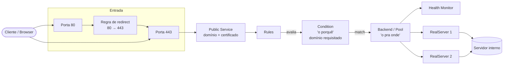

# Firewall / HAProxy

## Visão geral

| Campo | Valor |
|---|---|
| **Nome** | Firewall/HAProxy |
| **Descrição** | Responsável pelo roteamento HTTP baseado em domínio |
| **IP** | 162.16.0.1 |
| **Plataforma** | OPNsense (firewall geral) + plugin `os-haproxy` (versão 5.1) |

Este documento tem propósito consultivo: orientar a manutenção de roteamentos já
cadastrados e a criação de novos serviços no HAProxy, sem depender de
conhecimento prévio da configuração atual.

## Conceitos e componentes do plugin

- **Domínio wildcard**: domínio coringa já registrado no sistema, usado para
  cobrir múltiplos subdomínios sem certificado dedicado por subdomínio.
- **Domínios ACME**: domínios com certificado gerenciado por outro plugin
  (ACME), renovação automática.
- **RealServers**: servidores internos de destino (alguns com health-check
  ativo).
- **Backend Pools**: agrupamento de RealServers que atende a um Backend.
- **Public Services**: serviços públicos, atuando na porta 443 (HTTPS), com
  regra de redirecionamento da porta 80 para a 443.
- **Health Monitors**: verificações de saúde aplicadas aos RealServers/Pools.
- **Conditions**: critérios de avaliação (ex.: domínio requisitado) usados
  pelas Rules para decidir o roteamento.
- **Rules**: vinculam um Public Service a um Backend, usando uma Condition
  como critério de decisão.

### Convenção de nomenclatura observada

Os componentes seguem um padrão por aplicação, o que ajuda a localizar e
cadastrar novos serviços:

| Componente | Padrão | Exemplo |
|---|---|---|
| Public Service (HTTPS, porta 443) | `frontend-{app}-default` | `frontend-app-default` |
| Public Service (redirect, porta 80) | `frontend-{app}-redirect` | `frontend-app-redirect` |
| Backend padrão/catch-all | `backend-{app}-default` | `backend-app-default` |
| RealServer | `http-{app}-{numero}` | `http-app-82` |
| Rule adicional (fora do padrão default) | `rule_{finalidade}` | `rule_path_gravacoes` |

Todo Public Service HTTPS (443) tem um Public Service irmão na porta 80
cuja única função é redirecionar para a 443 — esse par se repete para cada
aplicação/serviço cadastrado.

## Fluxo lógico geral (dependências)

Sequência de uma requisição até o servidor interno:

1. Requisição chega no **Public Service** (porta 443), que tem domínio e
   certificado vinculados. Requisições na porta 80 são redirecionadas para a
   443 antes de seguir o fluxo.
2. O Public Service aplica as **Rules** cadastradas.
3. Cada Rule usa uma **Condition** (o *porquê*) para avaliar o domínio
   digitado e decidir se a regra se aplica.
4. Quando a Condition casa, a Rule direciona para um **Backend** (o *pra
   onde*).
5. O Backend distribui a requisição entre os **RealServers** do seu pool,
   respeitando o **Health Monitor** (quando configurado), e encaminha ao
   servidor interno correspondente.

## Aplicação principal

Referência interna: **APP** — a aplicação SaaS principal.

### Public Services

| Nome | Porta | Função |
|---|---|---|
| `frontend-app-default` | 443 (HTTPS) | Recepciona todo o tráfego HTTPS da aplicação |
| `frontend-app-redirect` | 80 (HTTP) | Apenas força o encaminhamento para a 443 |

### Backend

- **`backend-app-default`**: backend padrão do APP. Referencia os
  RealServers abaixo e o tráfego é balanceado entre eles.
- **Comportamento padrão (catch-all)**: todo tráfego que **não** se encaixa
  em nenhuma regra de domínio explícita cai neste backend — ou seja,
  `backend-app-default` funciona como destino default do HAProxy.
- **Health Monitor**: há um health-check específico vinculado a estes
  RealServers *(nome/parâmetros do monitor — a confirmar)*.

### RealServers

Tráfego balanceado entre os 4 hosts:

| RealServer |
|---|
| `http-app-82` |
| `http-app-83` |
| `http-app-84` |
| `http-app-85` |

### Rules

| Rule | Vinculada a | Comportamento |
|---|---|---|
| `rule_path_gravacoes` | `backend-app-default` | Redireciona path `/gravacoes/` → `/gravacoesHD/` *(detalhamento adicional a seguir)* |

### Pendências / a confirmar

- Domínio(s) associado(s) ao `frontend-app-default` (wildcard ou ACME
  específico).
- Nome/parâmetros do Health Monitor vinculado ao `backend-app-default`.
- Porta dos RealServers (`http-app-82`..`85`) no destino interno.
- Condition utilizada pela `rule_path_gravacoes` (detalhamento prometido
  para uma próxima etapa).

## Serviço de WebSocket

> Pendente — mesma estrutura de componentes da aplicação principal, porém com
> configuração dedicada.

## Serviços dedicados a clientes

> Pendente — exemplo representativo de um serviço dedicado a cliente
> (cenário similar ao de produção, com domínio específico).

## Passo a passo: cadastrar um novo serviço

> Pendente — sequência de criação/vínculo dos componentes acima na interface
> do OPNsense/HAProxy.
